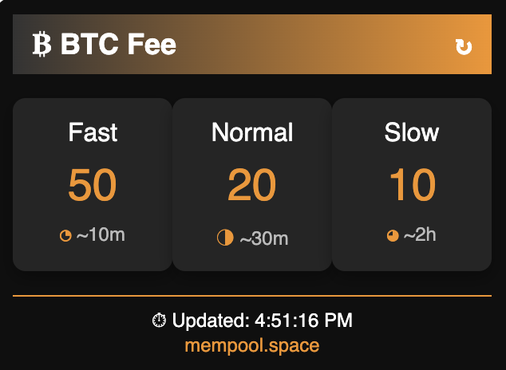

# BTC Fee Estimator

A lightweight Chrome Extension that provides real-time Bitcoin transaction fee estimates using the [mempool.space API](https://mempool.space). Get fast, normal, and slow fee rates at your fingertips!

## Features
- Real-time fee estimates for Bitcoin transactions
- Simple, modern UI with dark theme and Bitcoin-inspired design
- Refresh button to update fees instantly
- Powered by mempool.space API

## Installation

### From Chrome Web Store (Coming Soon)
1. Visit the [Chrome Web Store link](#) (TBA after publishing).
2. Click "Add to Chrome" and confirm installation.

### Manual Installation
1. Clone this repository:
   ```bash
   git clone https://github.com/abbaskhanthai/bitcoin-fee-extension.git
   ```
2. Open Chrome and go to `chrome://extensions/`.
3. Enable "Developer mode" in the top right.
4. Click "Load unpacked" and select the `btc-fee-estimator` folder.

## Usage
1. Click the extension icon in your Chrome toolbar.
2. View the current fee rates:
   - **Fast**: Confirmation in ~10 minutes
   - **Normal**: Confirmation in ~30 minutes
   - **Slow**: Confirmation in ~2 hours
3. Click the refresh button (↻) to update fees manually.

## Screenshots


## Development

### Prerequisites
- Chrome browser
- Basic knowledge of JavaScript, HTML, and CSS

### Setup
1. Clone the repo:
   ```bash
   git clone https://github.com/abbaskhanthai/bitcoin-fee-extension.git
   ```
2. Modify the code in `popup.js`, `popup.html`, or `styles.css` as needed.
3. Test by loading the extension in Chrome (`chrome://extensions/` > Load unpacked).

### Dependencies
None! Pure JavaScript with no external libraries.

## Contributing
Contributions are welcome! Here's how:
1. Fork this repository.
2. Create a new branch (`git checkout -b feature/your-feature`).
3. Commit your changes (`git commit -m "Add your feature"`).
4. Push to your branch (`git push origin feature/your-feature`).
5. Open a Pull Request.

## License
This project is licensed under the MIT License - see the LICENSE file for details.

## Acknowledgments
- Powered by mempool.space API
- Inspired by the Bitcoin community
